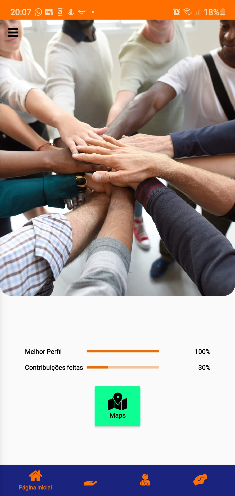
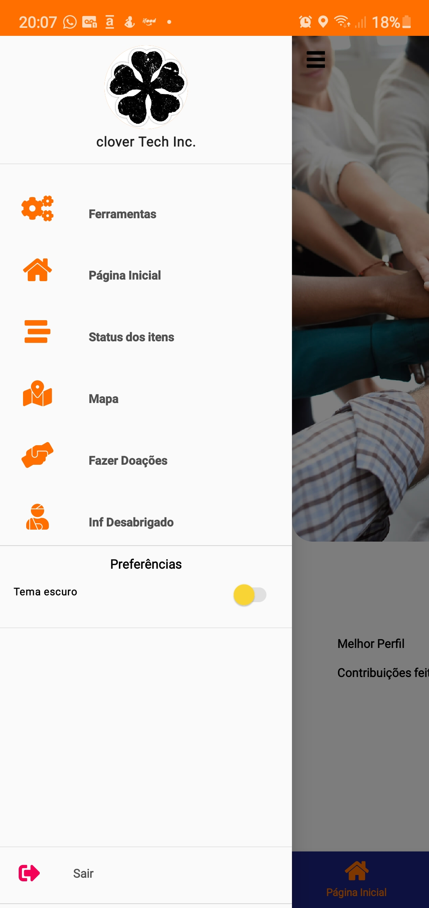
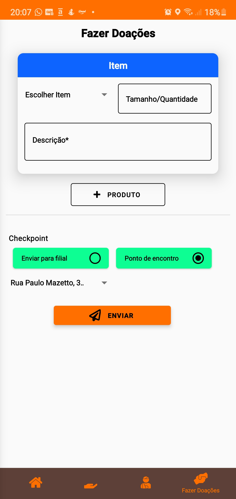
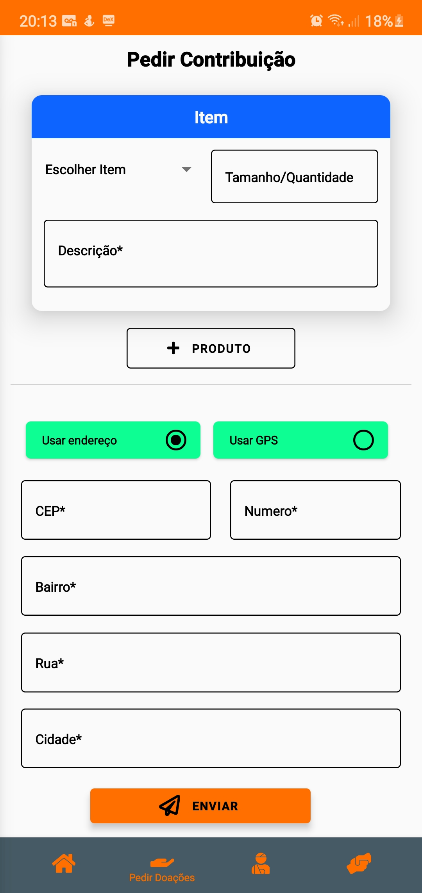
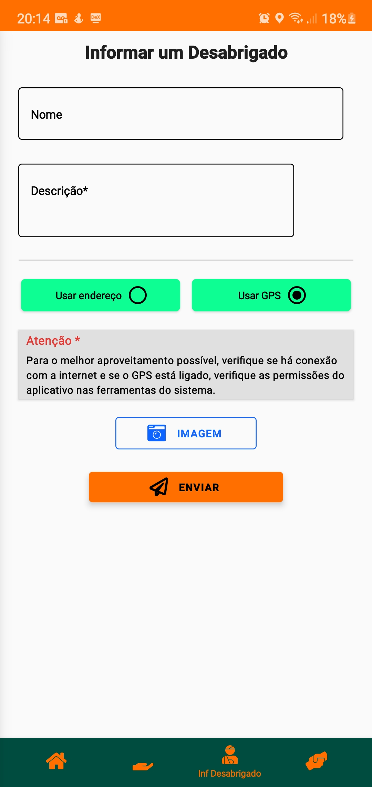

# Yes!YouCanHelp
> Uma aplicação mobile, que tem o objetivo de ajudar em uma causa social.

## Objetivo
Pessoas que precisam de alguma ajuda, que queiram fazer alguma doação dos produtos disponiveis no aplicativo.
Pessoas do tipo juridica com ONGs, Prefeituras e Empresas privadas que precisam de dados para que de alguma forma ajudem no objetivo de ajudar na causa social.

>Tela de login

        

## Ações no aplicativo
Usuarios tem opções de fazer uma doação, ou pedir um produto no qual ele necessita, sendo pra ele ou para uma pessoa terceira.
Usuario com nivel de Pessoa Fisica podem fazer mesmas ações que usuarios do tipo comum fazem no Yes!YouCanHelp, como também visualizar dados mais especifico, buscando por filtros disponivel na tela de Busca Avançada

## Galeria

        
        
        
        
        

